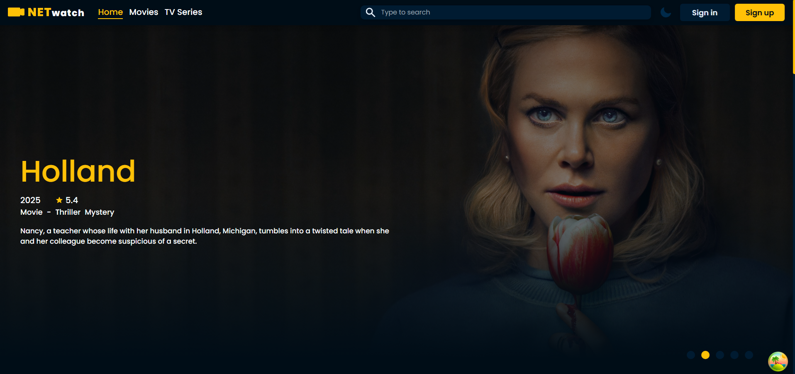

# NETwatch

NETwatch is a full-stack movie and TV series application created as an engineering thesis project. The app uses a React frontend and an ASP.NET Core backend that communicates with The Movie Database API and stores user data in a SQL Server database.

Users can browse movies and TV series, search productions, open detailed pages, check cast and providers, create an account, and manage a personal watchlist.

## Preview



## Features

- Browse trending movies and TV series
- Browse popular, now playing, top-rated, and trending movies
- Browse popular, top-rated, and trending TV series
- Search for movies and TV series
- Movie detail page with:
  - movie details
  - credits
  - videos
  - similar movies
  - watch provider data
- TV series detail page with:
  - TV series details
  - credits
  - videos
  - similar TV series
  - watch provider data
- Person page with combined credits
- Cast/credits page
- Movie and TV series lists based on TMDB discover endpoints
- Genre, region, and watch-provider data fetched from TMDB
- User registration and login
- JWT-based authentication
- Password hashing with BCrypt
- Protected account settings
- Password update
- Account deletion
- User watchlist
- Add movies or TV series to the watchlist
- Remove items from the watchlist
- Update watchlist item data:
  - user status
  - user rating
  - watched episodes
- Public user watchlist page
- Watchlist sorting and filtering by:
  - rating
  - user rating
  - year
  - title
  - media type
  - status
- Dark mode toggle
- Responsive UI helpers and carousel-based layouts
- Client-side data fetching and caching with TanStack React Query
- Global client state with Redux Toolkit

## Tech Stack

### Frontend

- React
- TypeScript
- Vite
- React Router
- Redux Toolkit
- React Redux
- TanStack React Query
- React Query Devtools
- React Hook Form
- React Hot Toast
- Framer Motion
- React Icons
- React Select
- React Responsive
- React Slick
- React Multi Carousel
- React Slider
- CSS

### Backend

- ASP.NET Core
- .NET 8
- C#
- Entity Framework Core
- SQL Server
- JWT Bearer Authentication
- BCrypt.Net
- Newtonsoft.Json
- Swagger / Swashbuckle
- TMDB API integration

## Project Structure

```txt
Movie-App-NETwatch/
├── inzynierka-movie-app.Server/
│   ├── Controllers/
│   │   ├── CreditsController.cs
│   │   ├── HomeController.cs
│   │   ├── ListsController.cs
│   │   ├── MovieController.cs
│   │   ├── PersonController.cs
│   │   ├── SearchController.cs
│   │   ├── UsersController.cs
│   │   └── WatchlistController.cs
│   ├── Data/
│   ├── Migrations/
│   ├── Models/
│   ├── Services/
│   ├── Program.cs
│   ├── appsettings.json
│   └── inzynierka-movie-app.Server.csproj
│
├── inzynierka-movie-app.client/
│   ├── public/
│   ├── src/
│   │   ├── features/
│   │   │   ├── Account/
│   │   │   ├── AccountSettings/
│   │   │   ├── Authentication/
│   │   │   ├── Credits/
│   │   │   ├── DarkMode/
│   │   │   ├── Homepage/
│   │   │   ├── Lists/
│   │   │   ├── Movie/
│   │   │   ├── Person/
│   │   │   └── Watchlist/
│   │   ├── helpers/
│   │   ├── hooks/
│   │   ├── pages/
│   │   │   ├── AboutUs/
│   │   │   ├── AccountPage/
│   │   │   ├── CastPage/
│   │   │   ├── Contact/
│   │   │   ├── FAQ/
│   │   │   ├── HomePage/
│   │   │   ├── MoviePage/
│   │   │   ├── MoviesList/
│   │   │   ├── PageNotFound/
│   │   │   ├── PersonPage/
│   │   │   ├── SearchPage/
│   │   │   ├── SettingsPage/
│   │   │   ├── TVSeriesList/
│   │   │   └── TvSeriesPage/
│   │   ├── services/
│   │   ├── styles/
│   │   ├── ui/
│   │   ├── utils/
│   │   ├── App.tsx
│   │   ├── main.tsx
│   │   └── store.ts
│   ├── package.json
│   └── vite.config.ts
│
├── inzynierka-movie-app.sln
├── netlify.toml
├── package.json
└── README.md
```

## Getting Started

### Prerequisites

Make sure you have installed:

- .NET 8 SDK
- Node.js
- npm
- SQL Server or access to a SQL Server database
- TMDB API access token

## Installation

Clone the repository:

```bash
git clone https://github.com/AcePeQ/Movie-App-NETwatch.git
cd Movie-App-NETwatch
```

## Backend Setup

Go to the backend project:

```bash
cd inzynierka-movie-app.Server
```

Restore .NET dependencies:

```bash
dotnet restore
```

Update the database if you want to apply the existing Entity Framework migrations:

```bash
dotnet ef database update
```

Run the backend:

```bash
dotnet run
```

The backend is configured as an ASP.NET Core application and exposes controllers for home data, movies, TV series, search, lists, users, watchlist, credits, and people.

## Frontend Setup

Go to the frontend project:

```bash
cd inzynierka-movie-app.client
```

Install dependencies:

```bash
npm install
```

Run the frontend:

```bash
npm run dev
```

Build the frontend:

```bash
npm run build
```

Preview the production build:

```bash
npm run preview
```

## Available Scripts

Run these commands inside `inzynierka-movie-app.client/`:

```bash
npm run dev      # Start Vite development server
npm run build    # Compile TypeScript and build the app
npm run lint     # Run ESLint
npm run preview  # Preview the production build
```

Run these commands inside `inzynierka-movie-app.Server/`:

```bash
dotnet restore   # Restore backend dependencies
dotnet run       # Run the ASP.NET Core backend
dotnet build     # Build the backend project
```

## API Overview

The backend uses controller routes in this format:

```txt
/[Controller]/[Action]
```

### Home

```txt
GET /Home/GetAllTypesTrending
GET /Home/GetMovies
GET /Home/GetTVSeries
```

### Movies and TV Series

```txt
GET /Movie/GetMovie/{id}
GET /Movie/GetTVSeries/{id}
GET /Movie/GetModalMovie?isMovie=true&id={id}
```

### Search

```txt
GET /Search/GetSearch/{query}
```

### Lists

```txt
GET /Lists/GetRegions
GET /Lists/GetMovieGenres
GET /Lists/GetTVSeriesGenres
GET /Lists/GetListMovies/{url}?page={page}
GET /Lists/GetListTVSeries/{url}?page={page}
GET /Lists/GetMovieWatchProviders/{region}
GET /Lists/GetTVSeriesWatchProviders/{region}
```

### Credits and People

```txt
GET /Credits/GetCredits?type=movie&id={id}
GET /Credits/GetCredits?type=tv&id={id}
GET /Person/GetPerson/{id}
```

### Users

```txt
POST /Users/Register
POST /Users/Login
GET  /Users/GetUser/{username}
POST /Users/UpdateSettings
POST /Users/DeleteAccount
```

### Watchlist

```txt
POST /Watchlist/AddMovie
POST /Watchlist/DeleteMovie
POST /Watchlist/UpdateMovie
GET  /Watchlist/GetUserWatchlist/{username}
```

## Author

Created by [AcePeQ](https://github.com/AcePeQ).
